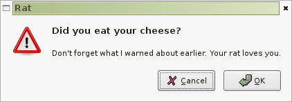
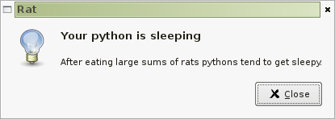

===============
Rat User Manual
===============

Common Dialogs
--------------

These are all functions from `rat.hig` module.

Error dialog::

    hig.error(
        "Could not save requested file",
        "The location where you're trying to save is write protected.",
        title = "Rat"
    )

Warning dialog::

    hig.warning(
        "Time to eat cheese!",
        "Not eating cheese will make your rat thiner and sad.",
        title = "Rat"
    )

OK/Cancel dialog::

    response = hig.ok_cancel(
        "Did you eat your cheese?",
        "Don't forget what I warned about earlier. Your rat loves you.",
        title = "Rat"
    )
    if response == gtk.RESPONSE_OK:
        print "Nice you're rat is happy!"
    else:
        print "You've have canceled the action and your rat cries."

You can change the OK button to another one::

    hig.ok_cancel(
        "Do you want to open a magic file?",
        "Magic files are only visible to the eyes of the beholder!",
        title = "Rat",
        ok_button = gtk.STOCK_OPEN,
    )

    hig.ok_cancel(
        "Do you want to cook cheese?",
        "Your python is really hungry and your rat is skinny, please feed him.",
        title = "Rat",
        ok_button = "Feed The Mouse",
    )

.. image:: dialog_ok_cancel_stock_id.png

Information dialog::

    hig.info(
        "Your python is sleeping",
        "After eating large sums of rats pythons tend to get sleepy.",
        title="Rat"
    )

Listing dialog
--------------

If you want to show the user a collection of things then you should use a
listing dialog. An example usage is to show a list of files you could not save::

    hig.listing(
        "Some rats escaped the cage",
        "You might want to look at the walls to find out why they are escaping.",
        list_title = "Rat names:",
        items = ("John", "Mickey", "Fatty"),
        title = "Rat"
    )

You can customize the buttons used in the dialog and ommit the list title::

    hig.listing(
        "Some rats escaped the cage",
        "You might want to look at the walls to find out why they are escaping.",
        items = ("John", "Mickey", "Fatty"),
        title = "Rat",
        buttons = ("I Don't Care", gtk.RESPONSE_OK),
    )

Save changes dialog
-------------------

Another usefull dialog is the save changes dialog. You send a list of filenames
that you want to ask if the user wants to save them the dialog will show a
list of files and enable your users to choose them from.

If you are only going to save one file the dialog adapts to it and shows a
simple OK/Cancel like dialog.

If you supply the date (in the form of datetime.datetime object) of when was
the last time the object was saved *and* you are supplying only one file it
will show the the time that has passed since the last save. It will even update
the label as the time passes!

But here's a simple example::

    files_to_save, response = hig.save_changes(["foo", "bar"], title="Rat Demo")
    if response in (gtk.RESPONSE_CANCEL, gtk.RESPONSE_DELETE_EVENT):
        print "The user wants to abort the action."
        return
    
    for filename in files_to_save:
        print "The user wants to save this file:", filename

And another example showing off the `last_save`::

    import datetime
    files_to_save, response = hig.save_changes(
        ["foo"],
        datetime.datetime.now(),
        title="Rat Demo"
    )

Choice Dialog
-------------

A choice dialog provides a powerfull way of asking your users to choose data
from a list of strings. The concept is simple you provide the primary and 
secondary texts, you also provide an optional primary text if the list has
only one item.

Then you have to define the range of selected numbers, for
example if the user can only choose one option, if the user can choose multiple
items and so on. If the user can choose zero elements a button will appear
for skipping the choice (like 'Close without saving' button on the example
before).

You can optionally show a cancel button.

The dialog will adapt itself depending on the type of selection range and
the number of elements. I will show you know the number of possible types of
dialogs.

Let the user choose only 1 element::

    indexes, response = hig.choice(
        "Choose the type of cheese",
        "Rats have different tastes. Some cheeses makes them love you more then others",
        one_item_text = "Do you want to choose %s?",
        allow_cancel = True,
        title = "Rat",
        min_select = 1,
        max_select = 1,
        items = ("Asiago", "Roquefort", "Sao Jorge", "Langres", "Mozzarella",
                 "Ricotta", "Baron", "Emmental", "Boursin", "Cheddar")
    )
    if response == gtk.RESPONSE_OK:
        for index in indexes:
            rat.feed(cheeses[index])

Let the user choose only 1 element but with fewer items and showing a list
title::

    hig.choice(
        "Choose the type of cheese",
        "Rats have different tastes. Some cheeses makes them love you more then others",
        one_item_text = "Do you want to choose %s?",
        allow_cancel = True,
        title = "Rat",
        min_select = 1,
        max_select = 1,
        list_title = "Cheeses:",
        items = ("Baron", "Emmental", "Boursin", "Cheddar")
    )

Let the user choose only 1 element but with only 1 item and still showing the
list title (which will not be displayed) but not showing the cancel button::

    hig.choice(
        "Choose the type of cheese",
        "Rats have different tastes. Some cheeses makes them love you more then others",
        one_item_text = "Do you want to choose %s?",
        allow_cancel = False,
        title = "Rat",
        min_select = 1,
        max_select = 1,
        items = ("Roquefort",)
    )

Now onto multiple selection. Let's create an example on allowing the user
to at least 1 element. Let's also change the OK button.::

    hig.choice(
        "Choose the type of cheese",
        "Rats have different tastes. Some cheeses makes them love you more then others",
        one_item_text = "Do you want to choose %s?",
        allow_cancel = True,
        title = "Rat",
        min_select = 1,
        max_select = -1,
        items = ("Asiago", "Roquefort", "Sao Jorge", "Langres", "Mozzarella",
                 "Ricotta", "Baron", "Emmental", "Boursin", "Cheddar"),
        ok_button = "Make Them Fat"
    )

Finally we'll use the multiple selection but only with item and a stock icon
on the OK button::

    hig.choice(
        "Choose the type of cheese",
        "Rats have different tastes. Some cheeses makes them love you more then others",
        one_item_text = "Do you want to choose %s?",
        allow_cancel = True,
        title = "Rat",
        min_select = 1,
        max_select = -1,
        items = ("Asiago",),
        ok_button = gtk.STOCK_YES
    )

We've covered all the examples. The only problem here is when the user supplies
a number of items lower then the number of minimum selection, this will raise
a `TypeError` so you must check it before you call this function.